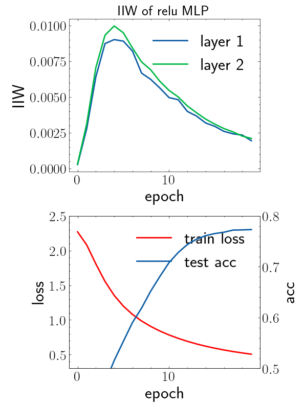
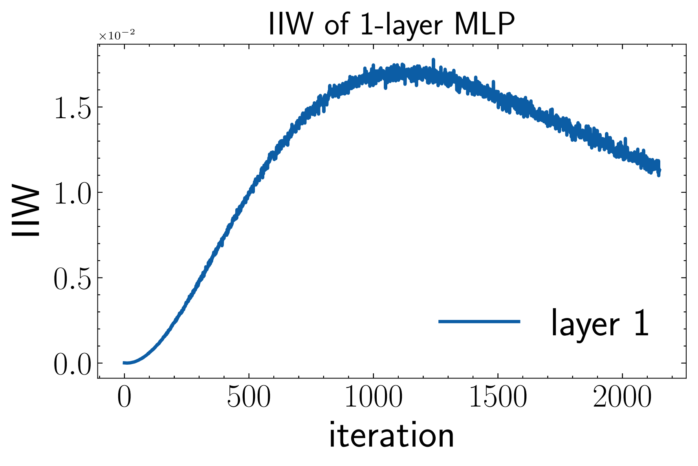
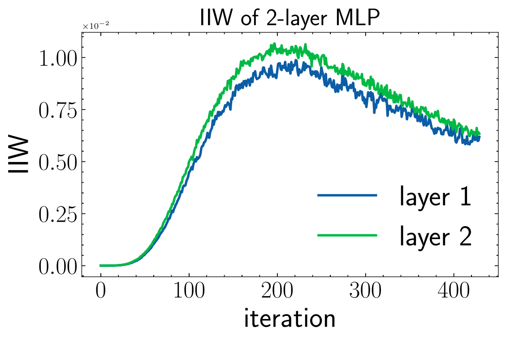
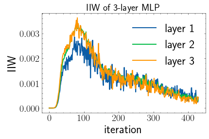
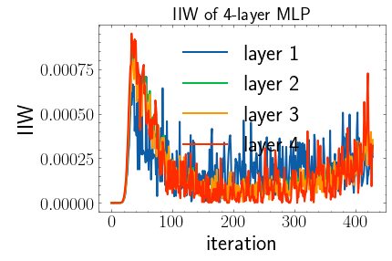
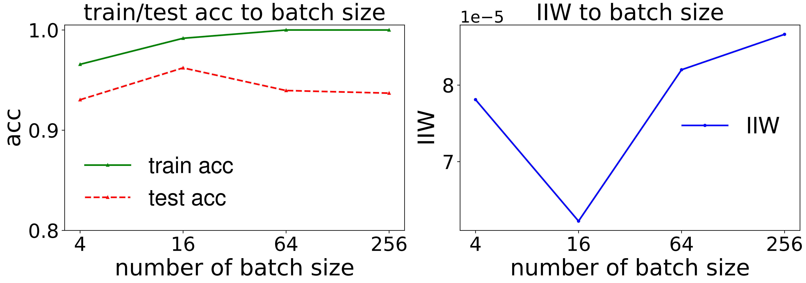

## :star:PAC-Bayes Information Bottleneck

This repo provides the demonstration of our recent paper on identifying information in deep neural networks through *PAC-Bayes Information Bottleneck*.

How do we **train an MLP model and track the information in weights during the training**? Just use the following codes!

```python
from src.models import MLP
from src.dataset import load_data
from src.utils import plot_info_acc
from src import train_track_info, img_preprocess, train_prior

# pre-process the input mnist data
x_tr, y_tr, x_va, y_va, x_te, y_te = load_data('mnist')
x_tr, y_tr = img_preprocess(x_tr, y_tr)
x_va, y_va = img_preprocess(x_va, y_va)
x_te, y_te = img_preprocess(x_te, y_te)

# initialize the model and get the prior for tracking information
model = MLP()
model.cuda()
train_prior(model, x_va, y_va)

# trigger training and view the information trajectory!
info_dict, loss_acc_list = train_track_info(model, list(range(len(x_tr))), x_tr, y_tr, x_va, y_va, 
                               num_epoch=20,
                               batch_size=128, 
                               lr=1e-4,
                               weight_decay=0,
                               track_info_per_iter=-1, # track the information after how many iterations
                               verbose=False,)
plot_info_acc(info_dict, loss_acc_list, 'relu', './')
```

we shall get the following image

<p float="left">
  
</p>

which reproduces the experiment results in the paper.

It is also easy to transform a model to PAC-Bayes IB augmented one! See the following codes:

```python
from src.models import VGG
from src.dataset import load_data
from src import img_preprocess, train_prior, train_iiw

# load data
x_tr, y_tr, x_va, y_va, x_te, y_te = load_data('cifar10')
x_tr, y_tr = img_preprocess(x_tr, y_tr)
x_va, y_va = img_preprocess(x_va, y_va)
x_te, y_te = img_preprocess(x_te, y_te)

# initialize model and get prior
model = VGG()
model.cuda()
train_prior(model, x_va, y_va)

# train with iiw regularization!
# specify the parameters you want for computing IIW and regularize
# or just set param_list=None to use all parameters for trainining!
param_list = ['extract_feature.0.weight', 'extract_feature.2.weight']
info_dict, loss_acc_list = train_iiw(model, list(range(len(x_tr))), 
                                    x_tr, y_tr, x_va, y_va,
                                    param_list=param_list,
                                    verbose=True,)
```


### :fire:For reproducing the phase transition phenomenon captured by PAC-Bayes IB

1. please refer to the jupyter notebook **demo_track_information.ipynb**.

<p float="left">
  
  
</p>

<p float="left">
  
  
</p>

we can see that deeper layer accelerate the fitting and compressing of deep neural networks!


### :fire:For reproducing the information in weights w.r.t. batch size and generalization gap

1. please refer to the jupyter notebook **demo_batch_size_info.ipynb**.

   <p float="left">
     
   </p>

we can see that the IIW corresponds to the generalization gap (train acc - test acc) on the left hand side!


### :fire:For comparing the performance of the PIB-based SGD algorithm:

1. download CIFAR10 from http://www.cs.toronto.edu/~kriz/cifar.html
2. unzip the file under **./data/cifar-10-python**
3. use `python run_vgg_PIB.py`


or refer to **demo_track_pac_bayes_ibpynb** for a look.


### :smile:If you find this result interesting, please consider to cite this paper:

```latex
@article{wang2021pacbayes,
    title={PAC-Bayes Information Bottleneck},
    author={Zifeng Wang and Shao-Lun Huang and Ercan E. Kuruoglu and Jimeng Sun and Xi Chen and Yefeng Zheng},
    year={2021},
    eprint={2109.14509},
    archivePrefix={arXiv},
    primaryClass={cs.LG}
}
```

