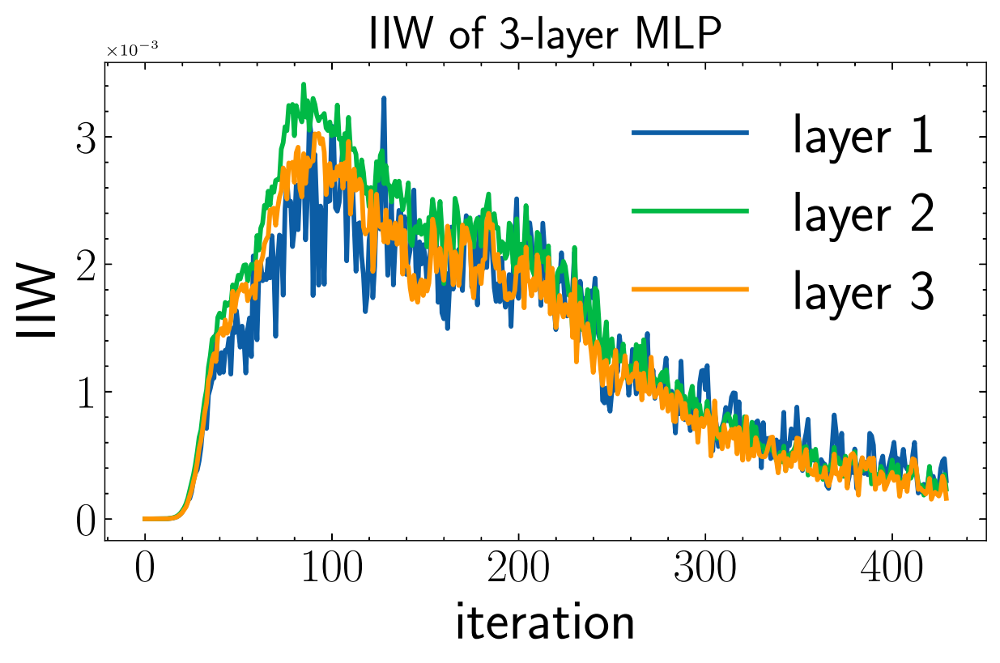
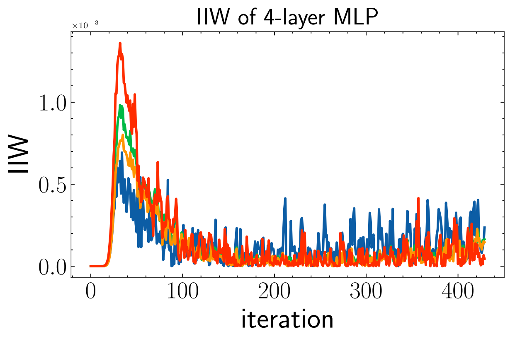

## :star:PAC-Bayes Information Bottleneck

This repo provides the demonstration of our recent paper on identifying information in deep neural networks through *PAC-Bayes Information Bottleneck*.


### :fire:For reproducing the phase transition phenomenon captured by PAC-Bayes IB

1. please refer to the jupyter notebook **demo_track_information.ipynb**.

<p float="left">
  
  
</p>

<p float="left">
  
  
</p>

we can see that deeper layer accelerate the fitting and compressing of deep neural networks!


### :fire:For comparing the performance of the PIB-based SGD algorithm:

1. download CIFAR10 from http://www.cs.toronto.edu/~kriz/cifar.html
2. unzip the file under **./data/cifar-10-python**
3. use `python run_vgg_PIB.py`


or refer to **demo_track_pac_bayes_ibpynb** for a look.


### :smile:If you find this result interesting, please consider to cite this paper:

```latex
@article{wang2021pacbayes,
    title={PAC-Bayes Information Bottleneck},
    author={Zifeng Wang and Shao-Lun Huang and Ercan E. Kuruoglu and Jimeng Sun and Xi Chen and Yefeng Zheng},
    year={2021},
    eprint={2109.14509},
    archivePrefix={arXiv},
    primaryClass={cs.LG}
}
```

